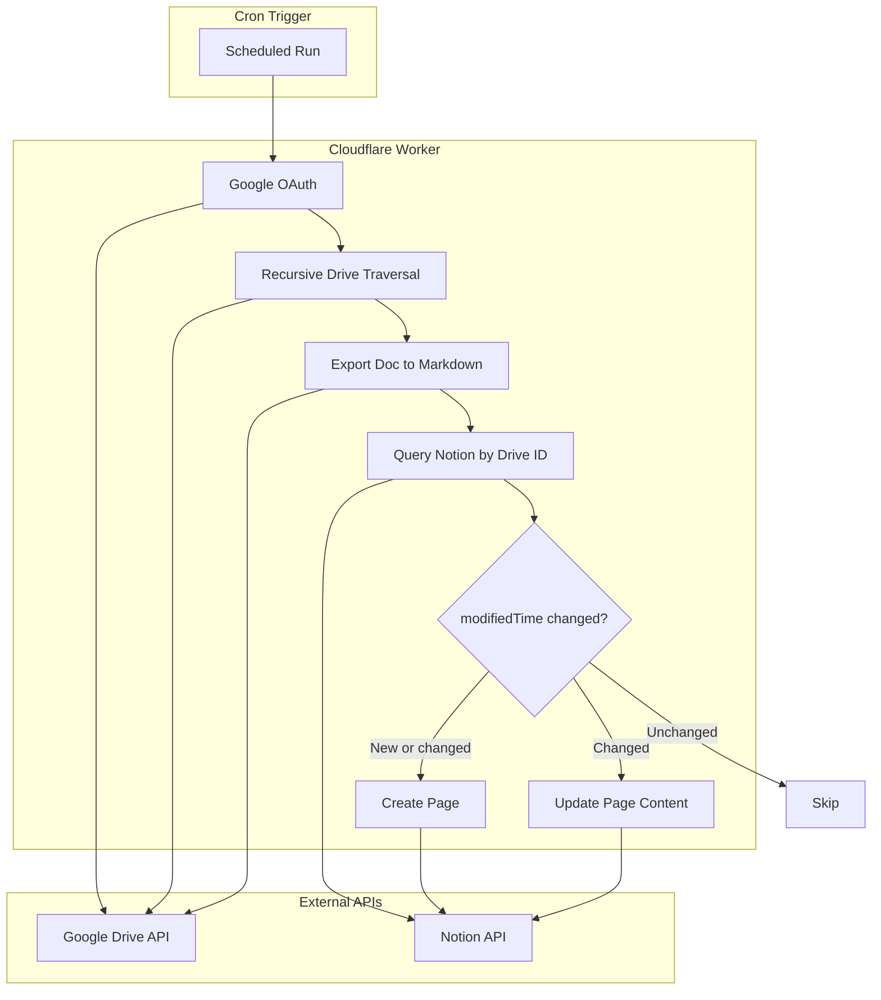

# Drive-to-Notion Sync Implementation Plan

## Architecture Overview




## Key Technical Decisions

### 1. Google Docs Only (Native Markdown Export)

Google Drive API supports exporting Google Docs directly to **Markdown** (`text/markdown` MIME type). No conversion library needed. This preserves headings, lists, bold/italic, and other styling that maps to markdown.

### 2. Change Detection Mechanism

- **Notion database schema**: Add `Drive File ID` (text, unique) and `Drive Modified` (date) properties
- **Sync logic**: For each doc, query Notion by `Drive File ID`. If no match → create. If match exists and `modifiedTime` from Drive equals stored `Drive Modified` → skip. If Drive is newer → update page content and `Drive Modified` property.

### 3. Cron Limits

- Cron triggers: **15 min** max duration (when interval >= 1 hour)
- Drive is small enough to process all documents in a single cron run; no Queues needed.

---

## Implementation Phases

### Phase 1: Google Drive Authentication and API Client

**Authentication:** Use a **Google Service Account** with **domain-wide delegation** to impersonate a Workspace user who has access to the shared drive.

#### Domain-Wide Delegation Setup (Detailed Instructions)

**Part A: Google Cloud Console – Create service account and enable Drive API**

1. **Create or select a project**
  - Go to [Google Cloud Console](https://console.cloud.google.com/)
  - Create a new project or select an existing one
2. **Enable the Google Drive API**
  - Go to **APIs & Services > Library**
  - Search for "Google Drive API" and click **Enable**
3. **Create a service account**
  - Go to **IAM & Admin > Service Accounts**
  - Click **Create service account**
  - Enter a name (e.g. "Drive-to-Notion Sync") and optional description, click **Create and continue**
  - (Optional) Grant IAM roles if needed for other GCP resources; for Drive API only, you can skip. Click **Continue** then **Done**
  - Click the newly created service account to open its details
4. **Create a service account key**
  - In the service account page, go to the **Keys** tab
  - Click **Add key > Create new key**
  - Choose **JSON**, click **Create** – a JSON key file will be downloaded. Store it securely; you will need it for Wrangler secrets
5. **Note the Client ID**
  - In the service account details, expand **Advanced settings**
  - Copy the **Client ID** (numeric, e.g. `123456789012345678901`) – you will need it for domain-wide delegation

**Part B: Google Workspace Admin Console – Grant domain-wide delegation**

*Requires a Google Workspace super administrator account. Skip if you are not an admin.*

1. **Open Domain-wide delegation**
  - Sign in to [Google Admin Console](https://admin.google.com/) as a super administrator
  - Go to **Menu > Security > Access and data control > API controls**
  - Click **Manage Domain Wide Delegation**
2. **Add the service account**
  - Click **Add new**
  - In **Client ID**, paste the service account's Client ID (from Part A, step 5)
  - In **OAuth Scopes**, enter the Drive read scope (comma-delimited if multiple):
    ```
    https://www.googleapis.com/auth/drive.readonly
    ```
  - Click **Authorize**
3. **Verify**
  - Point to the new client ID and click **View details** – ensure the scope is listed
  - If a scope is missing, click **Edit**, add it, and click **Authorize** again
  - Propagation can take up to 24 hours but is often faster (minutes)

**Part C: Choose a user to impersonate**

- Pick a Google Workspace user who has access to the shared drive (e.g. `admin@yourdomain.com` or a dedicated "sync" user)
- That user's email is the `sub` claim in the JWT when requesting access tokens
- Store this as `GOOGLE_IMPERSONATE_USER` in Wrangler secrets

**JWT construction for domain-wide delegation**

- When building the JWT, include `sub` in the claim set:
  ```json
  { "iss": "<client_email>", "sub": "<impersonate_user@domain.com>", "scope": "https://www.googleapis.com/auth/drive.readonly", "aud": "https://oauth2.googleapis.com/token", "exp": ..., "iat": ... }
  ```
- Use RS256 to sign with the service account's private key

**Files to create:**

- `[src/lib/google-drive.ts](src/lib/google-drive.ts)` – Drive API client with:
  - `getAccessToken()` – JWT-based auth for service account (with `sub` for impersonation)
  - `listFiles(driveId, folderId?, pageToken?)` – files.list with `corpora=drive`, `driveId`, `supportsAllDrives=true`
  - `exportAsMarkdown(fileId)` – GET `files/{id}/export?mimeType=text/markdown`

**Wrangler secrets:**

- `GOOGLE_SERVICE_ACCOUNT_JSON` – full JSON key file content (or use separate vars: `client_email`, `private_key`, etc.)
- `GOOGLE_IMPERSONATE_USER` – email of the Workspace user to impersonate (e.g. `admin@yourdomain.com`)
- `GOOGLE_DRIVE_SHARED_DRIVE_ID` – target shared drive ID

---

### Phase 2: Recursive Drive Traversal

**Algorithm:**

1. Start at shared drive root (driveId equals root folder ID for shared drives)
2. `files.list` with `q: "'{folderId}' in parents and trashed = false"`, `corpora: "drive"`, `driveId`, `supportsAllDrives: true`
3. For each item: if `mimeType === 'application/vnd.google-apps.document'` → add to processing list; if `mimeType === 'application/vnd.google-apps.folder'` → recurse
4. Paginate with `pageToken` until no more results

**Files to create:**

- `[src/lib/drive-traversal.ts](src/lib/drive-traversal.ts)` – `listAllGoogleDocs(driveId)` async generator or function returning `{ id, name, modifiedTime, parents }[]`

---

### Phase 3: Notion API Client and Markdown-to-Blocks

**Notion database setup:**

- Create database (or document schema) with properties: `Name` (title), `Drive File ID` (text), `Drive Modified` (date), optionally `Drive Path` (text)
- Share database with the Notion integration

**Markdown → Notion blocks (Option A – lightweight mdast parser):**

Use **micromark** + **mdast-util-from-markdown** to parse markdown into an mdast AST, then map AST nodes to Notion block types. This keeps the bundle small and handles edge cases (nested lists, code blocks, inline formatting).

- **Dependencies:** `micromark`, `mdast-util-from-markdown` (and any mdast types)
- **Flow:** `markdown string` → `mdast Root` → walk AST → emit Notion blocks (paragraph, heading_1/2/3, bulleted_list_item, numbered_list_item, code, blockquote, etc.)
- **Inline formatting:** Map `strong` → bold, `emphasis` → italic in `rich_text` annotations
- Verify bundle size stays under Workers limit (3 MB free / 10 MB paid)

**Files to create:**

- `[src/lib/notion.ts](src/lib/notion.ts)` – Notion client:
  - `queryDatabaseByDriveId(databaseId, driveFileId)` – filter by `Drive File ID`
  - `createPage(databaseId, { title, driveFileId, driveModified, markdown })` – create page + append blocks
  - `updatePage(pageId, { markdown, driveModified })` – replace page content + update `Drive Modified` property
- `[src/lib/markdown-to-blocks.ts](src/lib/markdown-to-blocks.ts)` – parse markdown with mdast, map to Notion block array

**Wrangler secrets:**

- `NOTION_API_KEY` – integration token
- `NOTION_DATABASE_ID` – target database ID

---

### Phase 4: Sync Orchestration and Cron

**Main sync flow:**

1. List all Google Docs recursively from shared drive
2. For each doc: fetch markdown via export, query Notion by Drive File ID, compare modifiedTime
3. If new or changed: create page or update existing (replace content + update Drive Modified)
4. Respect **6 concurrent connections** limit – process sequentially or in small parallel batches
5. No Queues; all documents are processed in a single cron run (drive is small)

**Files to modify/create:**

- `[src/index.ts](src/index.ts)`:
  - `scheduled(event, env, ctx)` handler for cron
  - `fetch()` handler for health check or manual trigger (optional)
- `[wrangler.jsonc](wrangler.jsonc)`: Add `triggers: { crons: ["0 * * * *"] }` (hourly), `limits: { cpu_ms: 300000 }`

---

### Phase 5: Update Logic for Existing Pages

**Simple update flow:** When a doc was modified, replace the page content and update the Drive Modified property.

1. Retrieve existing page block children (paginate if needed)
2. Delete each block via `DELETE /v1/blocks/{block_id}`
3. Append new blocks from markdown (using `PATCH /v1/blocks/{page_id}/children`)
4. Update page properties via `PATCH /v1/pages/{page_id}` – set `Drive Modified` to the new `modifiedTime` from Drive

No special cases (e.g. archiving). Just delete old blocks, append new ones, update the date.

---

## Configuration Summary


| Secret/Config                  | Purpose                                     |
| ------------------------------ | ------------------------------------------- |
| `GOOGLE_SERVICE_ACCOUNT_JSON`  | Service account credentials (full JSON key) |
| `GOOGLE_IMPERSONATE_USER`      | Workspace user email to impersonate         |
| `GOOGLE_DRIVE_SHARED_DRIVE_ID` | Shared drive to sync                        |
| `NOTION_API_KEY`               | Notion integration token                    |
| `NOTION_DATABASE_ID`           | Target database ID                          |


---

## Dependency Additions

- **Phase 1–2:** No extra deps; use native `fetch` and Web Crypto for JWT signing
- **Phase 3:** `micromark`, `mdast-util-from-markdown` (and types) for markdown parsing; verify bundle size

---

## Error Handling and Edge Cases

- **Export size limit:** Drive export is capped at **10 MB**. Large docs may fail; log and skip, optionally retry.
- **Rate limits:** Google Drive and Notion have rate limits. Add simple retry with exponential backoff.
- **Partial failures:** Log failed file IDs; consider storing in KV for retry on next run.
- **Deleted docs:** Notion pages are not auto-deleted when a doc is removed from Drive. Optional: maintain a "last synced" file ID set, diff against current drive list, and archive/delete orphaned Notion pages.

